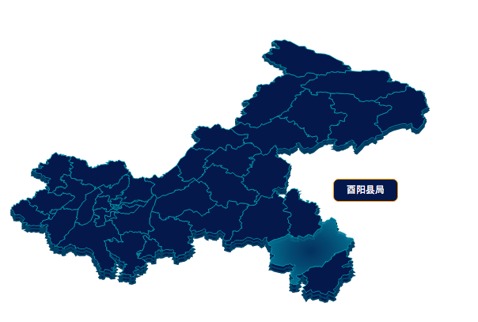

<!--
author: leo
date: 2016-11-02
title: d3的map绘制
tags: d3
category: frontend
status: publish
summary: d3的map绘制
-->

# 基于d3的map绘制
## 前言
开发环境ES6 + d3(3.x.x),组合使用构造函数模式和原型模式写的一个d3地图组件，效果图如下： 
>
一个比较好的d3中文API网站: [http://www.kancloud.cn/wizardforcel/d3-api-ref/101209](http://www.kancloud.cn/wizardforcel/d3-api-ref/101209)
## 代码
构造函数需要3个参数，地图的配置对象（以echarts的配置为标准），dom参数为一个svg的节点，mapJson参数为要绘制的地图的json文件，这里直接用的 ``Object.assign()`` 来Clone新的option和mapJson对象。
```javascript
//构造函数
function GlobalModel(option, dom, mapJson) {
    this.dom = dom
    this.option = Object.assign({}, option)
    this.mapJson = Object.assign({},mapJson)
    this.series = this.option.series
    this.projection
    this.zoom
    this.drag
    this.svg
    this._int()
}
```
初始化函数,这里需要根据配置文件里的各种配置来确定初始化哪些内容
```javascript
GlobalModel.prototype._int = function() {
    this._dragZoom()
    this._drawMap()
    this._mouseover()
    if( this.option.tooltip.show ) {
        this._intTooltip()
    }
}
```
绘制地图，总共有三层，第一层为区域轮廓，第二、三层为地图外边框，为了展现立体效果。根据配置确定是否需要初始化缩放、拖拽功能。
```javascript
GlobalModel.prototype._drawMap = function() {
    let w = this.option.geo.width
    let h = this.option.geo.height
    //设置地图投影
    this.projection = d3.geo.mercator()
        .center(this.option.geo.center)
        .scale(8000 * this.option.geo.zoom)
        .translate([w/2 + this.option.geo.left, h/2 + this.option.geo.top])
    let path = d3.geo.path()
        .projection(this.projection)
    //地图添加各个图层，拖拽，缩放等功能
    this.dom.select('svg').remove()
    let svg = this.dom.insert("svg:svg")
        .attr("width", w)
        .attr("height", h)
    this.svg = svg
    if(this.option.geo.roam) {
        svg.call(this.zoom)
    }
    if(this.option.geo.drag) {
        svg.call(this.drag)
    }
    //地图阴影层
    let outline2 = svg.append('svg:g')
        .attr('id', 'outline2')
        .style('transform', 'rotateX(49deg) scale(1.2, 1.2)')
    let outline = svg.append('svg:g')
        .attr('id', 'outline')
        .style('transform', 'rotateX(49.5deg) scale(1.2, 1.2)')
    //地图内部区域轮廓层
    let states = svg.append("svg:g")
        .attr("id", "states")
        .style('transform', 'rotateX(50deg) scale(1.2, 1.2)')
    states.selectAll("path")
        .data(this.mapJson.features)
        .enter()
        .append("svg:path")
        .attr("d", path)
        .attr('class', 'each_map')
        .attr('fill', this.option.series[0].itemStyle.normal.areaColor)
        .attr('stroke',  this.option.series[0].itemStyle.normal.borderColor)
        .attr('stroke-width','1px')
        .on('mouseover', function(d,i){
            let option = d.option
            let mouse = [event.x, event.y]
            //选中内发光
            d3.select(this)
                .attr('fill', 'url(#smallMap)')
            //展示tooltip
            let tooltip = d3.select('.tooltip')
                .style('display', 'block')
                .style('top', mouse[1] + option.tooltip.position[1] + 'px')
                .style('left', mouse[0] + option.tooltip.position[0] + 'px')
            if(option.tooltip.formatter instanceof Function){
                option.tooltip.formatter.call(this, this)
            }else{
                tooltip.html('')
                tooltip.html(d.properties.mC)
            }
        })
        .on('mouseout', function(d,i){
            //非选中恢复本来颜色
            d3.select(this)
                .attr('fill', d.option.series[0].itemStyle.normal.areaColor)
            //隐藏tooltip
            d3.select('.tooltip').style('display','none')
        })
    outline.selectAll("path")
        .data(this.mapJson.features)
        .enter()
        .append("svg:path")
        .attr("d", path)
        .attr('fill', '#04184b')
        .attr('stroke', '#004266')
        .attr('stroke-width', 3)
    outline2.selectAll("path")
        .data(this.mapJson.features)
        .enter()
        .append("svg:path")
        .attr("d", path)
        .attr('fill', '#04184b')
        .attr('stroke', '#004266')
        .attr('stroke-width', 3)
}
```
选中时内发光效果，发光颜色从配置中读取
```javascript
GlobalModel.prototype._mouseover = function() {
    let radialGradient = this.svg.append('defs')
        .append('radialGradient')
        .attr('id', 'smallMap')
    radialGradient.append('stop')
        .attr('offset', '0%')
        .style('stop-color', this.option.series[0].itemStyle.emphasis.areaColor)
        .style('stop-opacity', 0.3)
    radialGradient.append('stop')
        .attr('offset', '50%')
        .style('stop-color', this.option.series[0].itemStyle.emphasis.areaColor)
        .style('stop-opacity', 0.6)
    radialGradient.append('stop')
        .attr('offset', '100%')
        .style('stop-color', this.option.series[0].itemStyle.emphasis.areaColor)
        .style('stop-opacity', 1)
}
```
拖拽、缩放功能，这里直接使用的 css3 的 transfrome 属性，因为系统是要跑在IE上，如果重新绘制整个地图会引发特别严重的卡顿，但用的接口仍然是d3提供的API
```javascript
GlobalModel.prototype._dragZoom = function() {
    let resetChart = function(){
        let scale = this.style.transform.toString()
        let x = 0
        let y = 0
        let scaleNum = 1
        let transformStr = ''
        if(scale == ''){
            transformStr = 'translate(' + x + 'px,' + y + 'px) scale(' + scaleNum + ')'
        }else{
            //获取3个值
            let flag1 = scale.indexOf('translate(') + 10
            let flag2 = scale.indexOf('px,')
            let flag3 = scale.indexOf('px) scale(')
            let flag4 = -1
            x = parseFloat(scale.slice(flag1,flag2))
            y = parseFloat(scale.slice(flag2 + 3,flag3))
            scaleNum = parseFloat(scale.slice(flag3 + 10,flag4))
            //根据拖拽、缩放事件改变相应transfrom的值
            if(event.type === 'wheel'){
                if(event.wheelDelta > 0){
                    scaleNum = scaleNum < 0.6 ? scaleNum : scaleNum - 0.1
                } else {
                    scaleNum = scaleNum > 3 ? scaleNum : scaleNum + 0.1
                }
            }else{
                let moveX = event.movementX
                let moveY = event.movementY
                x = x + moveX
                y = y + moveY
            }
            transformStr = 'translate(' + x + 'px,' + y + 'px) scale(' + scaleNum + ')'
        }
        this.style.transform = transformStr
    }
    this.drag = d3.behavior.drag()
        .on('dragend', resetChart)
    //缩放
    this.zoom = d3.behavior.zoom()  
        .scaleExtent([1,10])//用于设置最小和最大的缩放比例
        .on('zoom', resetChart)
}
```
Tooltip 功能没有写好（扩展性不行），还需要完善，这里仅仅是在``_drawMap()``中简单的显示选中区域的名字
```javascript
GlobalModel.prototype._intTooltip = function() {
    let that = this
    function Tooltip(innerHTMl) {
        this.tooltipDom
        this.option = that.option.tooltip
        this._int()
    }
    Tooltip.prototype._int = function() {
        this.tooltipDom  = that.dom
            .append('div')
            .attr('class','tooltip')
            .style('position', 'absolute')
            .style('overflow', 'visible')
            .style('display', 'none')
            .style('z-index', 999)
            .style(this.option.style)
    }
    this.tooltip = new Tooltip(this.option.tooltip)
}
```